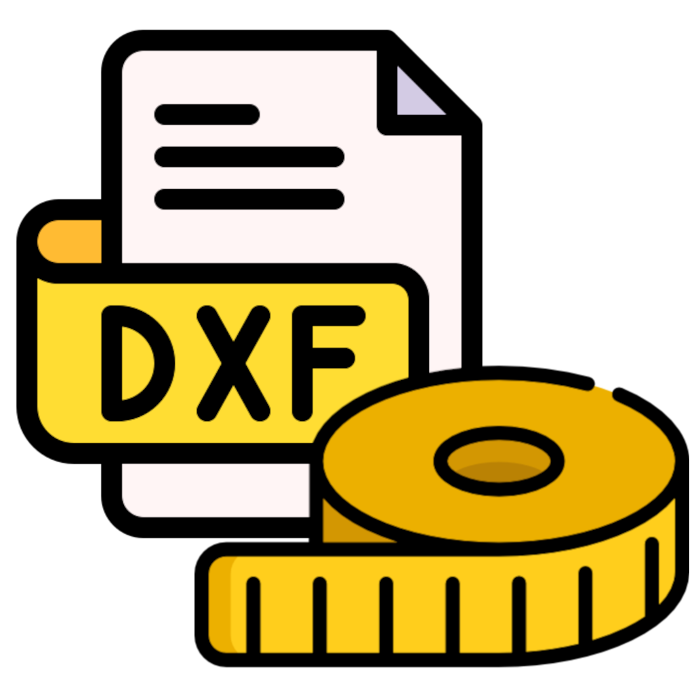

<p align="center">
  
</p>

# DXF Layer Report

DXF Layer Report is a desktop tool designed to scan DXF files, measure geometry on selected layers, and generate a consolidated Excel report.

It is built for production workflows where many DXF files must be checked quickly, consistently, and with clear reporting.

---

# What the Program Does

The application reads one DXF file or a complete folder of DXF files, searches for entities located on specific layers, calculates their total measurable length, and exports the results into an Excel workbook.

Typical use cases:

- CAD file control
- CNC / laser / cutting preparation / wielding
- Estimation of cutting lengths
- Batch verification of drawing files
- Production reporting
- Technical audits on DXF libraries

---

# Main Features

- Scan a single DXF file or an entire folder
- Optional recursive folder scan (subfolders included)
- Filter by one or multiple layers
- Case-insensitive layer matching
- Fast multi-worker processing
- Pause / Resume / Stop controls
- Live execution log
- Progress bar
- Excel export with results
- Handles common DXF geometry entities
- Robust processing with error reporting

---

# Supported Measurement Logic

The program measures supported geometry found on the requested layers.

Typical supported entities include:

- LINE
- ARC
- CIRCLE
- LWPOLYLINE
- POLYLINE (2D)

Polyline arc segments using bulge values are handled correctly.

---

# How to Use the Program

## 1. Launch the Application

Run:

```bash
python src/gui.py
```

## 2. Choose Input Mode

You can choose between:

### Folder
Use this when you want to scan many DXF files at once.

Example:
C:\Projects\DXF\

### Single File
Use this when you want to analyze only one drawing.

Example:
C:\Projects\DXF\part_001.dxf

## 3. Select the Path

Click **Browse** and choose the folder or file.

## 4. Enter Layers

The **Layers** field defines which layers must be measured.

Examples:

1
Measures only layer `1`

1,14
Measures layers `1` and `14`

CUT,ENGRAVE
Measures layers named `CUT` and `ENGRAVE`

1,CUT,OUTLINE
Multiple values are comma-separated.

Layer matching is case-insensitive.

---

# Understanding Workers

## What is a Worker?

A worker is a parallel processing unit used to scan multiple files faster.

Instead of processing files one by one, the program can process several files at the same time.

## Recommended Worker Values

- Small Folder (< 50 files): 2 to 4 workers
- Medium Batch (50 to 500 files): 4 to 8 workers
- Large Batch (500+ files): 8 to 16 workers

More workers do not always mean better performance.

Too many workers can create:
- CPU saturation
- Disk contention
- Higher memory usage

Best practice: test progressively.

---

# Scale to mm

The **Scale to mm** option applies a conversion factor to measured values.

Examples:
- Drawing already in mm: `1`
- Drawing in cm: `10`
- Drawing in meters: `1000`

---

# Controls

- **Start**: Launch the scan
- **Pause**: Temporarily pauses processing
- **Resume**: Continues after pause
- **Stop**: Stops the current scan safely

---

# Output Excel Report

At the end of the process, an Excel workbook is generated automatically.

Typical report content:

- File name
- Full path
- Measurement result
- Status
- Error details (if any)

---

# Performance Tips

- SSD: higher worker count usually works well
- HDD: moderate worker count recommended
- Very large DXF files: reduce workers if memory usage rises
- Close heavy apps before large scans

---

# Requirements

- Python 3.10+
- ezdxf
- openpyxl

Install:

```bash
pip install ezdxf openpyxl
```

---

# Run from Source

```bash
python src/gui.py
```

---

# License

MIT License

Copyright (c) 2026 fathergaascoigne
